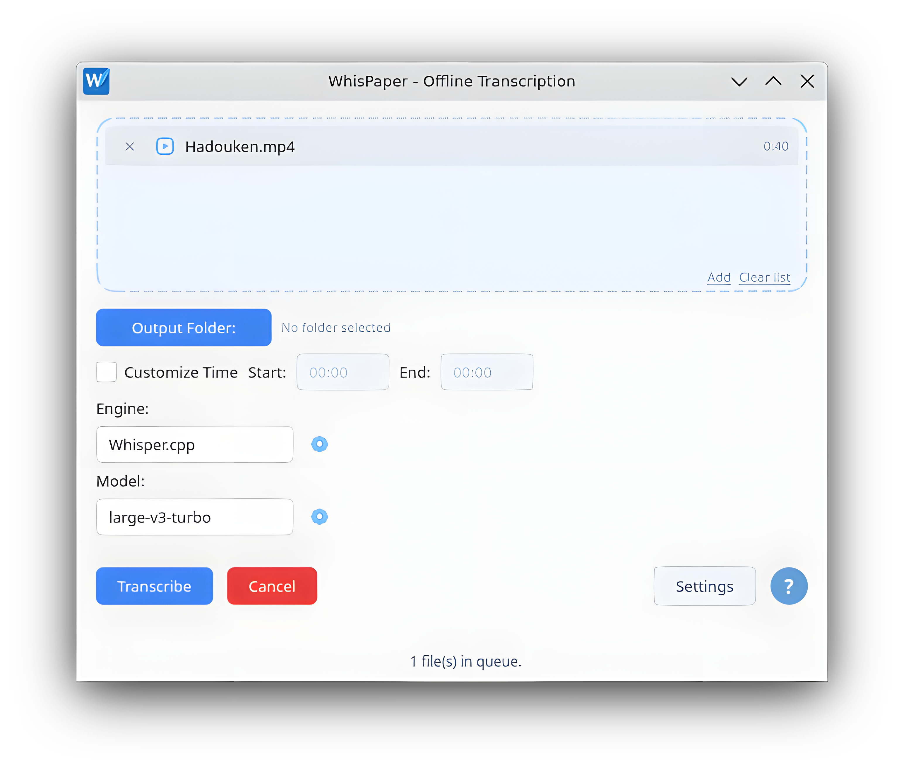

<p align="center">
  
</p>

<h1 align="center">WhisPaper</h1>

<p align="center">
  
  
  
  
</p>

<p align="center">
  <a href="README.pt-BR.md">🇧🇷 Leia em Português</a>
</p>

---

## What is WhisPaper?

WhisPaper is a cross-platform application (Windows and Linux) that makes offline audio and video transcription and translation easy. No cloud, no upload: all processing happens locally — WhisPaper respects your privacy.

<p align="center">
  
</p>

> ⚠️ **Windows notice:** the WhisPaper installer is currently unsigned. Windows SmartScreen may display an "Unknown publisher" warning the first time you run it. This is expected. Click **More info → Run anyway** to continue.

## Features

- Light and dark themes with automatic system theme detection.
- Multilingual interface, currently available in English and Brazilian Portuguese.
- Easy drag-and-drop file import.
- Batch processing for multiple files.
- Multiple output formats: TXT, SRT and VTT.
- Partial transcription, allowing only a selected time range to be processed.
- Transcription and translation, using the capabilities provided by the selected engine.
- Model Manager for downloading, importing and managing Whisper models directly from the application.
- GPU acceleration through Vulkan when available.
- Wide range of supported input formats, including MP3, WAV, FLAC, OGG, M4A, AAC, WMA, AIFF, OPUS, AMR, MP4, MOV, AVI, MKV, WEBM and 3GP.

## Getting Started

WhisPaper is designed to be simple and straightforward.

1. Open WhisPaper and add one or more audio or video files.
2. Choose the output folder, transcription engine, model and any desired options.
3. Click **Transcribe**.

## Installation

### Prebuilt release (recommended)

Download the latest release for your operating system from the [Releases page](../../releases).

- **Windows:** download and run the `.exe` installer.
- **Linux:** download the `.AppImage`, make it executable (`chmod +x WhisPaper.AppImage`) and launch it. The Linux whisper.cpp binaries are compiled inside an Ubuntu 22.04 container to keep the minimum required glibc low, for broader compatibility across distributions.

### Running from source

```bash
git clone https://github.com/pabloc08/WhisPaper.git
cd WhisPaper

python -m venv .venv
source .venv/bin/activate      # Windows: .venv\Scripts\activate

pip install -r requirements.txt
python main.py
```

### Requirements

- Python 3.11 or later.
- PySide6 6.9.3 or later (tested with 6.9.3).
- Httpx.
- FFmpeg and FFprobe available in the system PATH (on Windows, the app can install it on demand).

### Whisper.cpp binaries and VAD model

The app expects a single whisper.cpp build in a specific folder, along with the Silero VAD model. The app doesn't download any of this on its own — this section only matters if you want to manually change something. Grab the Silero VAD model from [ggml-org/whisper-vad](https://huggingface.co/ggml-org/whisper-vad), and build your own whisper.cpp binaries from [whisper.cpp](https://github.com/ggml-org/whisper.cpp):

```bash
cmake -B build \
  -DCMAKE_BUILD_TYPE=Release \
  -DGGML_NATIVE=OFF \
  -DGGML_CPU_ALL_VARIANTS=ON \
  -DGGML_BACKEND_DL=ON \
  -DBUILD_SHARED_LIBS=ON \
  -DGGML_VULKAN=ON

cmake --build build -j --config Release
```

> **Linux:** also add `-DCMAKE_INSTALL_RPATH='$ORIGIN' -DCMAKE_BUILD_WITH_INSTALL_RPATH=ON`. Without it, `whisper-cli` won't find the `.so` files on its own once copied straight into the app's folder (this workflow doesn't run `cmake --install`, it just copies the binaries from `build/`).

- **Windows:** `whisper-cli.exe` + all its `.dll` go into `%LOCALAPPDATA%\WhisPaper\whisper\bin\`; the Silero model goes into `%LOCALAPPDATA%\WhisPaper\whisper\models\`.
- **Linux:** same idea under `~/.local/share/WhisPaper/whisper/bin/` (`whisper-cli` + its shared libraries) and `~/.local/share/WhisPaper/whisper/models/`.

## Roadmap

- New engine implementations planned for the future (the app is already built to support them).
- ~~Live transcription preview with real-time progress.~~ Done!

## License

This project is licensed under [GNU GPLv3](LICENSE).

WhisPaper uses third-party components under their own licenses (whisper.cpp, PySide6/Qt, httpx, Silero VAD, Noto Sans font, among others). See [THIRD-PARTY-NOTICES.md](THIRD-PARTY-NOTICES.md) for the full list and copyright notices.

## Credits

- [whisper.cpp](https://github.com/ggerganov/whisper.cpp) by Georgi Gerganov — transcription engine.
- [OpenAI Whisper](https://github.com/openai/whisper) — original models.
- Interface built with [PySide6](https://pypi.org/project/PySide6/) (Qt for Python).
