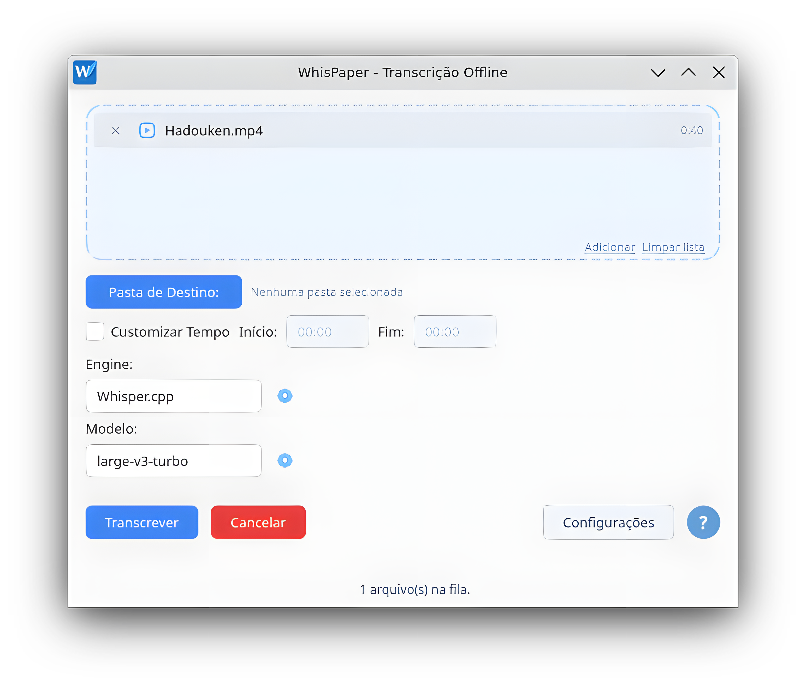

<p align="center">
  
</p>

<h1 align="center">WhisPaper</h1>

<p align="center">
  
  
  
  
</p>

<p align="center">
  <a href="README.md">🇺🇸 Read in English</a>
</p>

---

## O que é

WhisPaper é um aplicativo multiplataforma (Windows e Linux) que fornece uma experiência facilitada para transcrição e tradução offline de arquivos de áudio e vídeo. Sem nuvem, sem upload: todo o processamento acontece localmente — o WhisPaper respeita a sua privacidade.

<p align="center">
  
</p>

> ⚠️ **Aviso para Windows:** o instalador do WhisPaper ainda não possui assinatura digital. Por isso, o Windows SmartScreen poderá exibir um aviso de "aplicativo desconhecido" na primeira execução. Isso é esperado. Clique em **Mais informações → Executar assim mesmo** para continuar.

## Funcionalidades

- Tema claro e escuro com detecção automática do tema do sistema.
- Interface multilíngue, atualmente disponível em Português (Brasil) e Inglês.
- Importação simplificada de arquivos por arrastar e soltar.
- Processamento em lote de múltiplos arquivos.
- Múltiplos formatos de saída: TXT, SRT e VTT.
- Recorte de trechos, permitindo transcrever apenas um intervalo específico do áudio ou vídeo.
- Transcrição e tradução, com suporte aos recursos oferecidos pela engine selecionada.
- Gerenciador de modelos, para baixar, importar e gerenciar modelos Whisper diretamente pela interface.
- Aceleração por GPU via Vulkan quando disponível.
- Amplo suporte a formatos de entrada, incluindo MP3, WAV, FLAC, OGG, M4A, AAC, WMA, AIFF, OPUS, AMR, MP4, MOV, AVI, MKV, WEBM e 3GP.

## Como usar

O WhisPaper foi desenvolvido para oferecer uma experiência simples e direta.

1. Abra o WhisPaper e adicione um ou mais arquivos de áudio ou vídeo.
2. Escolha a pasta de destino, a engine, o modelo e ajuste as opções desejadas.
3. Clique em **Transcrever**.

## Como instalar

### Versão pronta (recomendado)

Baixe a versão mais recente na [página de Releases](../../releases).

- **Windows:** baixe o instalador `.exe` e execute-o.
- **Linux:** baixe o `.AppImage`, conceda permissão de execução (`chmod +x WhisPaper.AppImage`) e execute-o. Os binários do whisper.cpp para Linux são compilados dentro de um container Ubuntu 22.04, para manter a glibc mínima exigida baixa e garantir mais compatibilidade entre distribuições.

### Executando a partir do código-fonte

```bash
git clone https://github.com/pabloc08/WhisPaper.git
cd WhisPaper

python -m venv .venv
source .venv/bin/activate      # Windows: .venv\Scripts\activate

pip install -r requirements.txt
python main.py
```

### Requisitos

- Python 3.11 ou superior.
- PySide6 6.9.3 ou superior (testado com a 6.9.3).
- Httpx.
- FFmpeg e FFprobe disponíveis no PATH (no Windows, o aplicativo permite a instalação sob demanda).

### Binários do whisper.cpp e modelo do VAD

A release pronta já vem com tudo compilado e no lugar — isso aqui só importa se você for rodar a partir do código-fonte.

O app espera um único build do whisper.cpp em uma pasta específica, junto com o modelo Silero VAD. O app não baixa nada disso sozinho — esta seção só é importante caso queira modificar alguma coisa manualmente. Baixe o modelo Silero VAD em [ggml-org/whisper-vad](https://huggingface.co/ggml-org/whisper-vad), e compile suas próprias versões do whisper.cpp a partir de [whisper.cpp](https://github.com/ggml-org/whisper.cpp):

```bash
cmake -B build \
  -DCMAKE_BUILD_TYPE=Release \
  -DGGML_NATIVE=OFF \
  -DGGML_CPU_ALL_VARIANTS=ON \
  -DGGML_BACKEND_DL=ON \
  -DBUILD_SHARED_LIBS=ON \
  -DGGML_VULKAN=ON

cmake --build build -j --config Release
```

> **Linux:** adicione também `-DCMAKE_INSTALL_RPATH='$ORIGIN' -DCMAKE_BUILD_WITH_INSTALL_RPATH=ON`. Sem isso, o `whisper-cli` não encontra as `.so` sozinho quando copiado direto pra pasta do app (o fluxo aqui não roda `cmake --install`, só copia os binários do `build/` mesmo).

- **Windows:** `whisper-cli.exe` + todas as suas `.dll` vão em `%LOCALAPPDATA%\WhisPaper\whisper\bin\`; o modelo Silero vai em `%LOCALAPPDATA%\WhisPaper\whisper\models\`.
- **Linux:** mesma ideia em `~/.local/share/WhisPaper/whisper/bin/` (`whisper-cli` + suas bibliotecas compartilhadas) e `~/.local/share/WhisPaper/whisper/models/`.

## Roadmap

- Suporte ao Faster Whisper.
- Preview da transcrição em tempo real.
- Progresso da transcrição em tempo real.

## Licença

Este projeto é distribuído sob a [GNU GPLv3](LICENSE).

WhisPaper usa componentes de terceiros sob suas próprias licenças (whisper.cpp, PySide6/Qt, httpx, Silero VAD, fonte Noto Sans, entre outros). Veja [THIRD-PARTY-NOTICES.md](THIRD-PARTY-NOTICES.md) para a lista completa e os avisos de copyright.

## Créditos

- [whisper.cpp](https://github.com/ggerganov/whisper.cpp) por Georgi Gerganov — motor de transcrição.
- [OpenAI Whisper](https://github.com/openai/whisper) — modelos originais.
- Interface construída com [PySide6](https://pypi.org/project/PySide6/) (Qt for Python).
